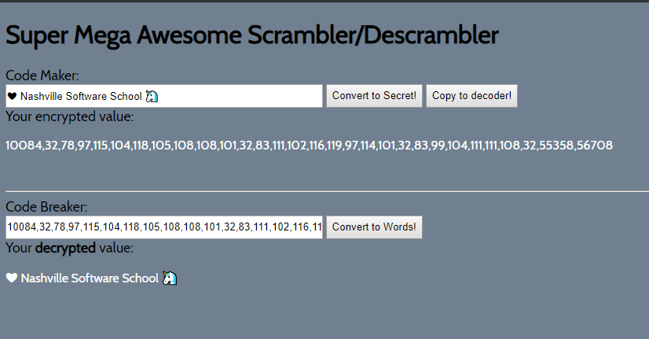

# code-maker-breaker

## Description

This project was a time bound pop quiz to test our skills in javascript, html, and css. This project allows you to enter values into an input field and click the button to convert it to UTF-16. I added a copy button that will copy the encoded value to the decode input because I am lazy.

We learned how to convert text strings to and from UTF-16. We were also challeneged to use the .forEach() method which we had not used up to this point.

## Screenshots


## How to run this project

- Use npm to install http-server in your terminal:

```sh
npm install -g http-server
```

- Run the server

```sh
hs -p 8080
```

- Open your browser and navigate to:

```
localhost:8080
```
